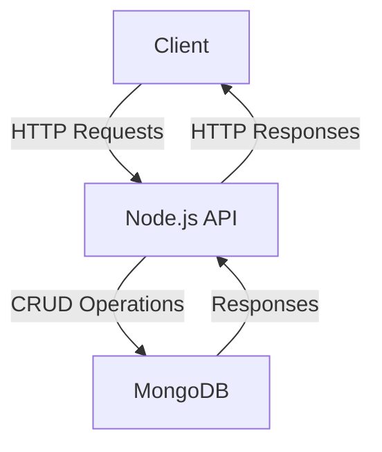
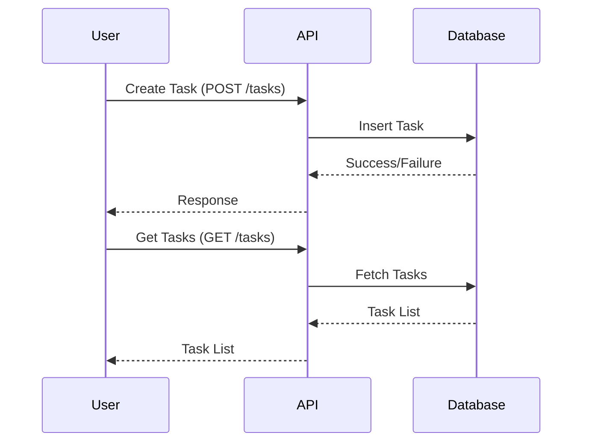

# Sample Node.js Application

This document provides an overview of a sample Node.js application, including its architecture and workflow, with the help of Mermaid diagrams.

## Application Overview

The sample Node.js application is a RESTful API that allows users to manage tasks. It includes the following components:
- **Express.js**: For handling HTTP requests and routing.
- **MongoDB**: As the database for storing tasks.
- **Mongoose**: For object data modeling (ODM).
- **Node.js**: As the runtime environment.

## Architecture Diagram



## Workflow Diagram



## Getting Started

To run the application locally, follow these steps:

1. Clone the repository:
   ```bash
   git clone https://github.com/your-repo/sample-nodejs-app.git
   cd sample-nodejs-app
   ```

2. Install dependencies:
   ```bash
   npm install
   ```

3. Start the application:
   ```bash
   npm start
   ```

4. Access the API at `http://localhost:3000`.

## Reference Links

- [Node.js Documentation](https://nodejs.org/en/docs/)
- [Express.js Guide](https://expressjs.com/)
- [MongoDB Documentation](https://www.mongodb.com/docs/)
- [Mongoose Documentation](https://mongoosejs.com/docs/)
